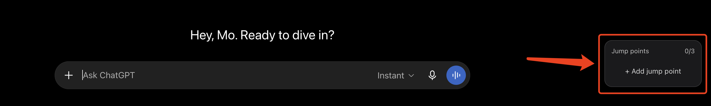
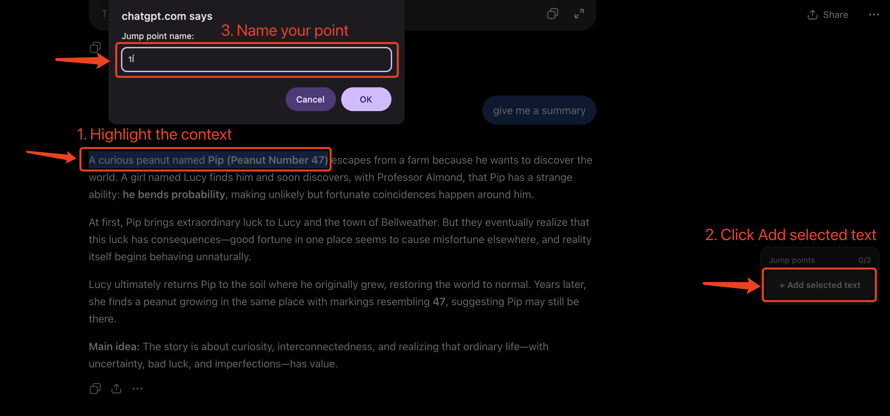
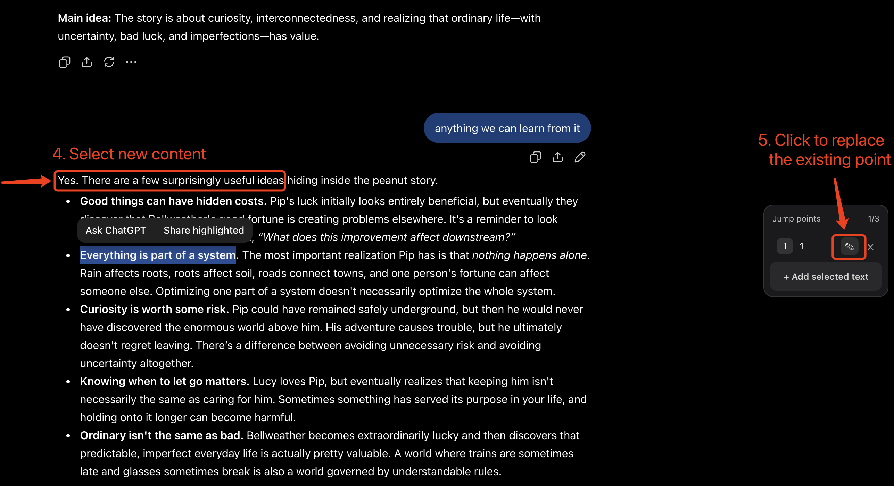
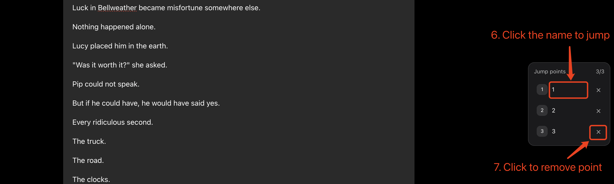

# Jump Points for ChatGPT

**Keep three places in reach. Jump back when you need them.**

Jump Points gives you three movable points inside your ChatGPT conversations.

Place them anywhere in conversations, jump back and forth between them, and move them as your work moves. The selected text marks a position — it isn't being added to a collection.

Update: v0.12.5 includes a compatibility fix for a recent ChatGPT frontend change and is currently under Chrome Web Store review. The latest source version is available here on GitHub.

## What it does

- **Three global Jump Points** — place your three points within the same chat or across different chats.
- **Long-distance restoration** — navigates through lazily rendered conversations until the target position becomes available.
- **Context-aware positioning** — uses surrounding text to distinguish between repeated selections and avoid jumping to the wrong occurrence.
- **Interruptible navigation** — click anywhere while a jump is in progress to stop it and take control back.
- **Fast replacement** — select a new position and replace any existing Jump Point.
- **Local storage** — Jump Point data stays in your browser.

## Requirements

Jump Points works with **signed-in ChatGPT conversations**. You must be logged in to ChatGPT before creating or using Jump Points.

Logged-out ChatGPT sessions are not currently supported.

## How to use it

### Add a Jump Point

1. Select text at the position you want to mark.
2. Click **Add selected text**.
3. Give the Jump Point a short name.

### Replace a Jump Point

You always have three slots.

When your focus moves:

4. Select the new position you want within reach.
5. Click **✎** on the Jump Point you want to move.

### Jump / Delete

6. Click the name of any Jump Point.

For a Jump Point in the current chat, one click jumps to the marked position.

For a Jump Point in a different chat, cross-chat navigation currently works in two steps:

1. Click the Jump Point once to open the destination chat.
2. Click the same Jump Point again to jump to the marked position.

For very long conversations, you may see the page travel through older messages while ChatGPT renders them. Once the target becomes available, Jump Points lands on the matching anchor.

If you want to stop an in-progress jump, simply click anywhere. Clicking another Jump Point stops the current jump and starts the new one.

7. Click **×** to remove a Jump Point.

## Why only three?

The limit is intentional.

Jump Points are a **working set, not an archive**. They hold the few positions you are actively moving between while working through long conversations.

When a point stops being useful, move it somewhere else.

> **Jump Points are disposable, not collectible.**

## Install

### Chrome Web Store

Jump Points is available on the Chrome Web Store. 

**v0.12.5 is currently under review and will be available through the Chrome Web Store once approved.**

[Install Jump Points for ChatGPT](https://chromewebstore.google.com/detail/jump-points-for-chatgpt/nimboknibfklpgojdheccejojlnekiba)

### Install from source

1. Click Code → Download ZIP on this repository, then unzip the downloaded file.
2. Open `chrome://extensions` in Chrome.
3. Turn on **Developer mode**.
4. Choose **Load unpacked**.
5. Select the extension **folder**.
6. Sign in to ChatGPT, open a conversation, select some text, and create your first Jump Point.

## Privacy

Jump Points is designed to work locally.

- No Jump Points account is required.
- No remote backend is required.
- Saved Jump Point data is stored in Chrome extension storage.
- The extension does not intentionally send saved conversation text to an external server.

Because Jump Points needs to create and restore anchors, it operates on ChatGPT page content in your browser.

## Status

**v0.12.5 — Public Beta (Chrome Web Store update under review)**

The core **Select → Add → Jump → Replace** interaction is working. Navigation through long conversations is interruptible, and repeated text is disambiguated using surrounding context. Same-chat jumps restore positions directly, while cross-chat jumps currently use the two-step flow described above.

v0.12.5 adds compatibility with ChatGPT's updated message DOM while retaining legacy selectors as fallbacks.

The Chrome Web Store update for v0.12.5 is currently under review.

For the engineering history, see [docs/evolution.md](docs/evolution.md).

## Roadmap

The current priority is reliability and a fast three-point navigation workflow.

The next milestone is a hardened **v1.0** release. Jump Points will remain focused on navigation rather than growing into a bookmark archive with folders, tags, search, or unlimited saved points.

## Acknowledgements

Portions of the text re-anchoring implementation were adapted from [Threadmark](https://github.com/ccheney/threadmark), an open-source project licensed under the MIT License.

Jump Points builds its own navigation and restoration system around this anchoring layer, including scroll-host detection, virtualized-content seeking, bidirectional restoration, continuous cruise, cross-conversation readiness handling, and the three-point working-set interaction model.

See [THIRD_PARTY_NOTICES.md](THIRD_PARTY_NOTICES.md) for license and attribution details.

## License

Jump Points for ChatGPT is licensed under the MIT License.

Portions of the code are adapted from third-party open-source software and remain subject to their respective license terms. See [THIRD_PARTY_NOTICES.md](THIRD_PARTY_NOTICES.md).
